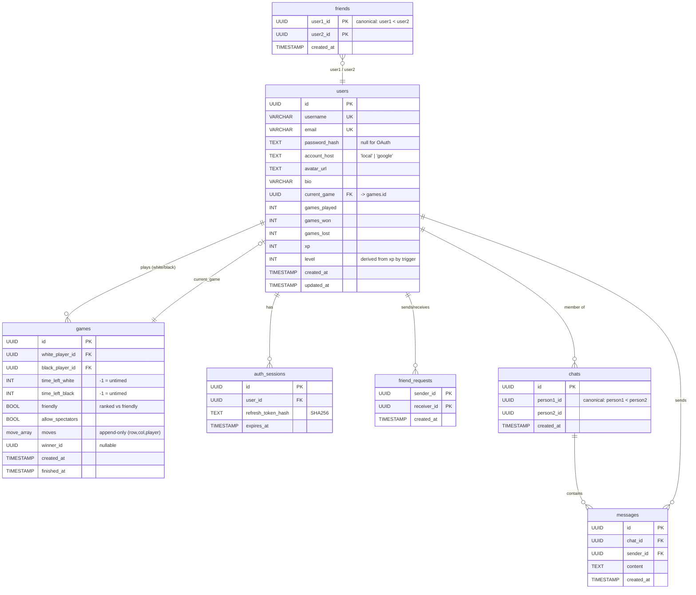

*This project has been created as part of the 42 curriculum by intherna, jpancorb, anguil-l, cmarrued, pmorello.*

# ft_transcendence — Reversi

> A real-time, server-authoritative online **Reversi (Othello)** platform, built for
> *ft_transcendence* of the 42 curriculum.
> Frontend design system: **Velocity Noir**.

---

## Table of Contents

- [Description](#description)
- [Team Information](#team-information)
- [Project Management](#project-management)
- [Technical Stack](#technical-stack)
- [Database Schema](#database-schema)
- [Features List](#features-list)
- [Modules](#modules)
- [Mandatory Requirements Compliance](#mandatory-requirements-compliance)
- [Instructions](#instructions)
- [Individual Contributions](#individual-contributions)
- [Resources](#resources)
- [Credits](#credits)
- [Known Limitations](#known-limitations)
- [License](#license)

---

## Description

**ft_transcendence — Reversi** is a full-stack web application where two players sign in,
get matched, and play a complete game of **Reversi** against each other in real time, with a
third-party audience able to spectate. The whole system is built around one rule: **the
server is the single source of truth**. The browser never decides whether a move is legal —
it only sends the *intent* to play a cell; the backend validates it with its own Reversi
engine, updates the game, persists it, and broadcasts the new state to both players and any
spectators.

The project began as a small MVP (register/log in, join a match, play to completion, store
the result) and has since grown into a small online game platform.

### Key Features

- **♟️ Real-time Reversi** — 8×8 board, server-validated moves, live turn/valid-move hints,
  optional per-player time limits, and pass detection.
- **🔐 Authentication** — email/password (Argon2 + JWT access/refresh tokens) **and** Google
  OAuth 2.0 sign-in.
- **🎯 Matchmaking** — a casual queue that pairs the next two waiting players and spins up a
  game session automatically.
- **👀 Spectators** — games can be opened to spectators, who receive the same live state
  stream as the players.
- **♻️ Crash recovery** — every move is persisted move-by-move; an in-progress game survives
  a backend restart by replaying its stored moves.
- **🧑‍🤝‍🧑 Social layer** — friends, friend requests, and 1-to-1 **direct chat**, plus in-game
  chat between players and spectators.
- **📈 Progression** — XP/level system (DB-driven), win/loss stats, and a global
  **leaderboard**.
- **👤 Profiles** — editable username/bio, avatar, and public profile pages.

The realtime layer runs over a **single binary WebSocket** with a custom, per-stage protocol
(auth → lobby → game). It is documented in [`docs/WEBSOCKETS.md`](docs/WEBSOCKETS.md).

---

## Team Information

> ⚠️ **The subject requires roles to be documented** (for a 5-person team: dedicated **PO**,
> **PM**, **Tech Lead**, and **2 Developers**) and evaluators will ask how they were
> distributed — so these `_TBD_` fields must be filled before evaluation. They are left blank
> here at the team's request. A suggested split based on actual code ownership: **Tech Lead**
> → inthernam; **PO** / **PM** → divide between jpancorb and one other member; **Developers**
> → everyone. The *Responsibilities* column already reflects each member's real area of work.

| Login | Name | Role | Main Responsibilities |
|-------|------|------|-----------------------|
| **inthernam** | Inti Hernández Servitja | _TBD_ | Realtime WebSocket subsystem (binary protocol, socket lifecycle, sessions, crash recovery), backend backbone & DB integration, frontend WS client and game hooks, project documentation. |
| **jpancorb** | Juan Miguel Pancorbo Gutiérrez | _TBD_ | Frontend architecture & UI (game board, lobby, profile, leaderboard, friends), the *Velocity Noir* design system, shared layout components, plus backend leaderboard/user/game work. |
| **cmarrued** | Carlos Marruedo | _TBD_ | Frontend pages and components (login/register, game view, profile, lobby, leaderboard) and supporting backend user/friend endpoints. |
| **anguil-l** | Antonio Guil Luque | _TBD_ | Authentication & security foundation: JWT access/refresh strategy, Argon2 password hashing, auth middleware, login/register integration. |
| **pmorello** | Pau Anand Morello | _TBD_ | User profile media (avatar/photo) features and repository housekeeping. |

See [Individual Contributions](#individual-contributions) for a detailed breakdown, and
[Credits](#credits) for former contributors.

---

## Project Management

- **Task tracking:** **Trello** — work was split into feature cards (game engine, backend
  domains, frontend pages, realtime, auth, infrastructure) and pulled by whoever owned that
  area.
- **Communication:** **Slack** — day-to-day coordination, code-review pings, and design
  discussions.
- **Version control workflow:** Git with a protected `main` branch. **Nobody commits directly
  to `main`** — every feature is developed on its own branch (e.g. `feature/game-logic`,
  `feature/backend-games`, `feature/realtime-sockets`, `feature/auth-login`) and merged via
  pull request. The team favored **merging often** and avoiding long-lived branches; shared
  data structures (game state, DB schema, the WS protocol) were discussed before being
  changed.
- **Work distribution:** ownership was organized by layer — game engine, backend/database,
  frontend, realtime, and auth/infrastructure — with members free to cross boundaries when a
  feature spanned several layers.

---

## Technical Stack

### Frontend
- **Next.js 16** (App Router) + **React 19**
- **TypeScript**
- **Tailwind CSS 3** (the in-house *Velocity Noir* pixel/neon design system)
- A custom **binary WebSocket client** (`frontend/lib/ws/`) and React hooks
  (`useAuth`, `useWs`, `useGame`, `useMsg`, `useGlobalRank`).

### Backend
- **Node.js + TypeScript**
- **Express 5** with **`express-ws`** for the WebSocket endpoint
- **Zod** for request validation
- **jsonwebtoken** (JWT) + **Argon2** (password hashing)
- A single service organized per domain (`auth`, `google`, `user`, `friend`, `chat`,
  `leaderboard`, `game`), each with `router` / `controller` / `service` / `repository`
  layers, plus the standalone Reversi engine and realtime `sync/` layer.

### Database
- **PostgreSQL 18**, initialized from a single `database/schema.sql`.
- **Why PostgreSQL?** The game model leans on features a relational engine gives for free:
  a custom composite `move` type and array columns (`moves move[]`) to store a game as an
  *append-only list of moves*, UUID primary keys, `CHECK`/`UNIQUE` constraints to keep
  friendships and chats canonical, and **stored functions + triggers** to push
  domain logic (XP→level derivation, game reporting, canonical-pair ordering, chat
  auto-creation) into the database itself. Postgres supports all of this natively.

### Gateway & Orchestration
- **nginx** (alpine) terminates TLS and reverse-proxies `/api/*` → backend (stripping the
  `/api` prefix), everything else → frontend, and passes through WebSocket upgrades.
  Exposed on host ports **8080** (HTTP → redirects to HTTPS) and **8443** (HTTPS).
- **Docker Compose** orchestrates four services (`database`, `backend`, `frontend`, `nginx`),
  wrapped by a **Makefile** and a `setup-env.sh` bootstrap script (env files + self-signed
  certs).

### Justification for major technical choices
- **Server-authoritative design** — game rules live *only* in the backend engine; the client
  displays state and sends intent. This makes cheating (forging a board / an illegal move)
  structurally impossible from the browser.
- **Single binary WebSocket + custom protocol** — one connection carries auth, lobby,
  matchmaking, chat, and gameplay. Binary framing keeps per-move messages tiny, and a
  per-stage type-ID namespace keeps the protocol compact. (Auth is sent in-band as the first
  message because the browser `WebSocket` API cannot set custom headers.)
- **Moves as the source of persistence** — a game is stored as its ordered list of moves, not
  a snapshot, so any game state can be rebuilt by replay. This is what enables **crash
  recovery** of in-progress games.

---

## Database Schema

The full schema lives in [`database/schema.sql`](database/schema.sql) and Postgres runs it on
first initialization. It defines a custom `move` composite type, the XP/level functions and
triggers, and helper functions (`report_game`, `add_game_movement`, `get_or_create_chat`,
`send_message`, `are_friends`, …).



**Tables and relationships**

- **`users`** — accounts (local or Google), profile fields, stats, and the `xp`/`level`
  progression. `level` is kept in sync with `xp` by a `BEFORE INSERT/UPDATE` trigger using
  `level_from_xp(xp)` (BASE 100, EXPONENT 1.5). `current_game` points to the game a user is
  currently in.
- **`games`** — one row per match, referencing two players. **There is no `board_state`
  column**: the `moves move[]` array (each element a `(row, col, player)` composite) *is* the
  game — the board is reconstructed by replaying it. `friendly` toggles ranked vs. XP-free
  games; `allow_spectators` gates the audience.
- **`auth_sessions`** — refresh-token sessions; the token is stored **SHA256-hashed**.
- **`friends`** — unordered unique pairs, stored canonically (`user1_id < user2_id`) via a
  trigger so a friendship is a single row regardless of direction.
- **`friend_requests`** — directional pending requests (`sender_id` → `receiver_id`).
- **`chats`** — one row per 1-to-1 conversation (also canonically ordered); a chat row is
  auto-created by trigger the moment two users become friends.
- **`messages`** — messages belonging to a chat, indexed for newest-first pagination.

Key data types: `UUID` primary keys everywhere, a custom `move` composite type
(`(row smallint, col smallint, player smallint)`), `TIMESTAMP` audit columns, and integer
counters for stats/XP.

---

## Features List

Attribution reflects primary ownership from the git history; most features were collaborative.

| Feature | Description | Primary contributor(s) |
|---------|-------------|------------------------|
| **Reversi game engine** | Board state, valid-move detection, move application, turn handling, pass/no-moves, game-over & winner logic (`backend/app/src/logic/game.ts`). | inthernam, jpancorb |
| **Realtime WebSocket protocol** | Single binary socket with auth → lobby → game stages, keep-alive, sessions, spectators, reconnect grace, crash recovery. | inthernam |
| **Frontend game UI** | Interactive board rendering, valid-move hints, timers, turn indicator, in-game chat, result screen. | jpancorb, cmarrued |
| **Matchmaking / lobby** | Casual queue that pairs waiting players and emits `MatchFound`. | inthernam, jpancorb |
| **Spectator mode** | Join a game as a viewer, receive live state, spectator join/leave events. | inthernam, jpancorb |
| **Email/password auth** | Registration, login, refresh, logout; Argon2 hashing; JWT access/refresh. | anguil-l |
| **Google OAuth 2.0 login** | Sign in / auto-register with a Google account. | inthernam |
| **Friends & requests** | Send/accept/reject friend requests, friends list. | jpancorb, cmarrued |
| **Direct & in-game chat** | 1-to-1 messaging over the socket; conversation history endpoint; in-game chat. | inthernam, jpancorb |
| **XP / level & stats** | DB-driven XP awards, derived levels, win/loss counts. | inthernam, jpancorb |
| **Leaderboard** | Global top-players ranking. | jpancorb |
| **User profiles** | Editable username/bio, avatar/photo, public profile pages. | cmarrued, pmorello |
| **Design system (Velocity Noir)** | Tailwind-based pixel/neon UI, shared layout (navbar, sidebar, chat window). | jpancorb |
| **Terms & Privacy page** | In-app terms of service and privacy policy. | jpancorb |

---

## Modules

The *ft_transcendence — Surprise* subject requires **14 points** (Major = 2 pts, Minor = 1 pt).
This project implements **17 points** — the 14 required plus **3 points of bonus** headroom.

### Major modules (2 pts each) — 6 × 2 = 12 pts

| # | Category | Module | How it was implemented | Contributor(s) |
|---|----------|--------|------------------------|----------------|
| 1 | Web | **Framework for frontend *and* backend** | **Next.js 16** (React) frontend + **Express 5** backend, each using their framework's routing/architecture conventions. | jpancorb, inthernam, anguil-l |
| 2 | Web | **Real-time features (WebSockets)** | A single binary WebSocket: live state broadcast to players & spectators, graceful connect/disconnect (reconnect grace period), efficient per-move framing. | inthernam, jpancorb |
| 3 | Web | **User interaction** | 1-to-1 chat (send/receive between users), public profile pages, and a friends system (add/remove, friends list). | inthernam, jpancorb, cmarrued |
| 4 | Gaming | **Complete web-based game** | A server-authoritative **Reversi** engine with clear rules and win/loss/draw conditions (2D). | inthernam, jpancorb |
| 5 | Gaming | **Remote players** | Two players on separate machines play in real time; latency-tolerant, with disconnect + **reconnection** handling (60s grace). | inthernam, jpancorb |
| 6 | User Management | **Standard user management & authentication** | Profile editing, avatars (with a default), friends + **online status**, profile pages; email/password with **Argon2 + JWT**. | anguil-l, inthernam, cmarrued |

### Minor modules (1 pt each) — 5 × 1 = 5 pts

| # | Category | Module | How it was implemented | Contributor(s) |
|---|----------|--------|------------------------|----------------|
| 7 | User Management | **Remote authentication (OAuth 2.0)** | Google Sign-in: authorization-code exchange with auto-provisioning of `account_host='google'` users. | inthernam |
| 8 | User Management | **Game statistics & match history** | Win/loss counts, XP/level ranking, finished-game records, and a global leaderboard. | jpancorb, inthernam |
| 9 | Gaming | **Game customization options** | Configurable match settings: timed vs. untimed, ranked vs. friendly, spectators on/off (with sensible defaults). | inthernam, jpancorb |
| 10 | Gaming | **Spectator mode** | Join a live game as a viewer with real-time state updates and shared in-game chat. | inthernam, jpancorb |
| 11 | Web | **Custom-made design system** | The *Velocity Noir* system — 200+ reusable component classes plus shared React components, a defined color palette, typography, and pixel/neon iconography. | jpancorb |

### Point calculation

| Tier | Count | Points |
|------|-------|--------|
| Major | 6 | 12 |
| Minor | 5 | 5 |
| **Total** | **11** | **17** |

That is **14 required + 3 bonus points** (the bonus part caps at 5 extra points; these three
modules beyond the 14-point threshold are the bonus candidates).

### Justification for module choices

The module set follows the shape of a competitive online board game:

- **The game itself** — a *complete web-based game* (Reversi) and *remote players* form the core loop.
- **Making it live** — *real-time WebSockets* power moves, matchmaking, chat, and spectating from a single connection.
- **Trustworthy accounts** — *standard user management* plus *OAuth 2.0* let players own an identity securely.
- **Reasons to interact and return** — *user interaction* (chat/friends/profiles), *game statistics*, *game customization*, and *spectator mode*.
- **Structure & identity** — a *framework on both ends* and a *custom design system* keep the app coherent and maintainable.

No "Modules of choice" (custom) modules were claimed — every module above maps to a listed subject module.

> **Demo checklist for evaluation:** for (8) show the per-user *match-history* view (dates/opponents/results), not just the leaderboard; for (11) the *Velocity Noir* system exceeds the required 10 reusable components (200+ component classes + shared React components). Everything else is demonstrable directly from the running app.

---

## Mandatory Requirements Compliance

The subject's general/technical requirements are met as follows:

| Requirement | Status | Where |
|-------------|--------|-------|
| Web app with frontend + backend + database | ✅ | Next.js · Express · PostgreSQL |
| Single-command containerized deploy | ✅ | `make` (Docker Compose: 4 services) |
| HTTPS for all browser↔backend traffic | ✅ | nginx TLS on `:8443`; HTTP `:8080` redirects to HTTPS |
| Credentials in git-ignored `.env` + `.env.example` provided | ✅ | `*.env` in `.gitignore`; `*.env.example` templates |
| Email/password auth with hashed passwords | ✅ | Argon2 (`utils/password-utils.ts`) |
| Frontend **and** backend input validation | ✅ | Zod schemas (backend) + form validation (frontend) |
| Clear DB schema with well-defined relations | ✅ | [`database/schema.sql`](database/schema.sql) |
| CSS framework / styling solution | ✅ | Tailwind CSS (*Velocity Noir*) |
| Multi-user, concurrent, real-time | ✅ | Per-user socket registry; live broadcast to all clients |
| Privacy Policy & Terms of Service pages | ✅ | In-app **Terms & Privacy** page (`app/(logged)/terms`) |
| Commits from all team members, clear messages | ✅ | Git history |

> Responsive design, latest-Chrome compatibility, and a warning-free browser console are
> targeted — verify them live at evaluation. Make sure the Terms/Privacy page is reachable
> from an always-visible link (e.g. a footer) as the subject expects.

---

## Instructions

### Prerequisites

| Tool | Version | Notes |
|------|---------|-------|
| **Docker Engine** | 24+ | With the **Compose v2** plugin (`docker compose`). |
| **GNU Make** | any recent | Drives the workflow via the `Makefile`. |
| **OpenSSL** | any | Used to generate the self-signed TLS certificate. |
| **Node.js** | 20+ | *Only* needed if you run the apps outside Docker (local dev). |

You also need host ports **8080** and **8443** free. Everything else (Node, Postgres) runs
inside containers.

> **Google login (optional):** to enable Google OAuth you need your own Google Cloud OAuth
> 2.0 credentials (`GOOGLE_CLIENT_ID`, `GOOGLE_CLIENT_SECRET`) and an authorized redirect URI
> of `https://localhost:8443/google`. Email/password auth works without them.

### Quick start

```bash
# 1. Clone
git clone <this-repo-url> transcendence
cd transcendence

# 2. Build everything (env files, TLS certs) and start the stack
make
```

`make` runs two steps:

1. **`make setup`** — bootstraps configuration if it's missing:
   - runs `setup-env.sh`, which **prompts you for a PostgreSQL password**, generates a random
     `JWT_SECRET`, and writes `backend/container/.env` and `database/container/.env` from
     their `.env.example` files;
   - copies `frontend/.env.example` → `frontend/.env`;
   - generates a self-signed TLS certificate into `nginx/certs/`.
2. **`make up`** — builds and starts the four containers (`database`, `backend`, `frontend`,
   `nginx`) in the background, then restarts nginx so it picks up fresh container IPs.

### Access

Open **https://localhost:8443** and accept the self-signed certificate warning.
(HTTP on **http://localhost:8080** redirects to HTTPS.)

### Environment configuration

Three env files are created from `*.env.example` templates:

- **`backend/container/.env`** — Postgres connection, `JWT_SECRET`, `JWT_ACCESS_EXPIRY`
  (default `15m`), `JWT_REFRESH_EXPIRY` (default `7d`), and the `GOOGLE_*` OAuth values.
- **`database/container/.env`** — `POSTGRES_DB`, `POSTGRES_USER`, `POSTGRES_PASSWORD`.
- **`frontend/.env`** — `NEXT_PUBLIC_API_URL`, `NEXT_PUBLIC_WS_URL`,
  `NEXT_PUBLIC_GOOGLE_CLIENT_ID`, `NEXT_PUBLIC_GOOGLE_REDIRECT_URI`.

> To enable Google login, replace the `GOOGLE_*` placeholders (backend) and
> `NEXT_PUBLIC_GOOGLE_*` values (frontend) with your own credentials.

### Useful Make targets

| Command | Description |
|---------|-------------|
| `make` / `make all` | Setup + build + start the full stack. |
| `make up` | Build & start containers (detached). |
| `make down` | Stop and remove containers. |
| `make clean` | `down -v` — also removes volumes (wipes the database). |
| `make re` | `clean` then `up` — full rebuild from scratch. |
| `make seed-db` | Seed the database with fake users/data (uses `@faker-js/faker`). |
| `make drop-db` | Drop game/user data via the backend script. |

### Local development (outside Docker)

```bash
# Backend
cd backend/app && npm install && npm run dev     # tsx watch on :3000

# Frontend
cd frontend && npm install && npm run dev         # next dev on :3000
```

### API & protocol references

- REST + auth endpoints: [`AUTH.md`](AUTH.md) and the Postman collection
  [`Transcendence_Auth_API.postman_collection.json`](Transcendence_Auth_API.postman_collection.json).
- Realtime binary protocol: [`docs/WEBSOCKETS.md`](docs/WEBSOCKETS.md).
- System overview: [`docs/architecture.md`](docs/architecture.md).

---

## Individual Contributions

### inthernam — Inti Hernández Servitja
- **Realtime subsystem (core):** designed and implemented the single binary WebSocket
  protocol — `Socket` wrapper, keep-alive/timeout, the auth/lobby/game handler stages, the
  `ByteReader`/`ByteWriter` binary codecs, `GameSession`/`SessionPlayer`, matchmaking, and
  spectators.
- **Persistence & crash recovery:** move-by-move persistence and
  `restoreUnfinishedSessions()`, which rebuilds live games by replaying stored moves after a
  restart.
- **Backend backbone & Google OAuth**, the frontend WebSocket client (`lib/ws`, `useWs`,
  `useGame`), and most of the project documentation (`architecture.md`, `WEBSOCKETS.md`).
- **Challenge:** browsers can't set headers on a `WebSocket` handshake — solved by an in-band
  `Token` handshake as the connection's first message. Keeping an in-memory `GameSession` and
  the database consistent under disconnects/reconnects was the hardest part, addressed with a
  60s reconnect grace period and replay-based recovery.

### jpancorb — Juan Miguel Pancorbo Gutiérrez
- **Frontend architecture & the *Velocity Noir* design system:** the game board UI, lobby,
  profile, leaderboard, and friends pages, plus shared layout (navbar, sidebar, chat window,
  current-game widget) and the app's styling.
- **Backend contributions:** leaderboard, and parts of the user/game domains and the sync
  layer.
- **Challenge:** rendering live board updates and valid-move hints smoothly from a stream of
  binary `MoveUpdate` frames while keeping the UI in sync with server-authoritative state.

### cmarrued — Carlos Marruedo
- **Frontend pages & components:** login/register flows, game view, profile, lobby, and
  leaderboard screens, plus supporting UI components.
- **Backend contributions:** user and friend endpoints and related sync work.
- **Challenge:** integrating the auth token lifecycle (access/refresh) into the frontend so
  protected pages and API calls transparently recover from expired tokens.

### anguil-l — Antonio Guil Luque
- **Authentication foundation:** the JWT access/refresh-token strategy, Argon2 password
  hashing, the route-protecting `authMiddleware`, and the register/login endpoints and their
  validation — documented in `AUTH.md` with a companion Postman collection.
- **Challenge:** designing a token model that separates short-lived access tokens from
  hashed, revocable refresh sessions (typed JWTs so a refresh token can't be used as an
  access token, and vice versa).

### pmorello — Pau Anand Morello
- **Profile media:** user avatar/photo features on the profile page.
- **Repository housekeeping:** cleanup of stray Windows `Zone.Identifier` artifacts.

---

## Resources

### References & documentation
- **Reversi / Othello rules** — [World Othello Federation rules](https://www.worldothello.org/about/about-othello/othello-rules/official-rules/english)
  and the [Reversi Wikipedia article](https://en.wikipedia.org/wiki/Reversi).
- **Next.js** — <https://nextjs.org/docs> (App Router).
- **React** — <https://react.dev/>.
- **Tailwind CSS** — <https://tailwindcss.com/docs>.
- **Express** — <https://expressjs.com/> and **`express-ws`** — <https://github.com/HenningM/express-ws>.
- **WebSockets** — [MDN WebSocket API](https://developer.mozilla.org/en-US/docs/Web/API/WebSocket)
  and the [`ws`](https://github.com/websockets/ws) library.
- **PostgreSQL** — <https://www.postgresql.org/docs/> (composite types, arrays, PL/pgSQL
  functions & triggers).
- **JSON Web Tokens** — [jwt.io](https://jwt.io/) and [RFC 7519](https://datatracker.ietf.org/doc/html/rfc7519).
- **Argon2 password hashing** — <https://github.com/ranisalt/node-argon2>.
- **Zod** — <https://zod.dev/>.
- **Google OAuth 2.0** — <https://developers.google.com/identity/protocols/oauth2>.
- **Docker Compose** — <https://docs.docker.com/compose/>.
- **nginx reverse proxy / WebSocket proxying** — <https://nginx.org/en/docs/>.

### How AI was used

> _Team: adjust this section to reflect your team's actual usage before submission._

AI assistants (primarily **Anthropic's Claude**, via **Claude Code**) were used during the
project as an accelerator, **not** as a replacement for the team's own design and
implementation decisions. Specifically:

- **Documentation** — drafting and polishing the project docs (this `README.md`,
  `docs/architecture.md`, `docs/WEBSOCKETS.md`, `AUTH.md`) from the actual source code and
  git history.
- **Design review & rubber-ducking** — sanity-checking the WebSocket protocol design, the
  server-authoritative move flow, and the crash-recovery approach.
- **SQL** — reviewing the PL/pgSQL functions and triggers (XP↔level conversion, canonical
  friend/chat ordering, `report_game`).
- **Debugging assistance** — investigating specific bugs and edge cases.

All AI-assisted output was reviewed, tested, and integrated by the team; game rules,
architecture, and the final code are the team's own work.

---

## Credits

- **Maximiliano Velázquez** *(former team member)* — made significant early contributions to
  the project's **infrastructure and backend**: the Docker Compose / nginx setup, the
  `Makefile`, backend database services (user/game/auth repositories & services), the initial
  game management endpoints, the seed/reset database scripts, and centralized error handling
  (`ApiError`). He is no longer part of the team but his work is gratefully acknowledged.

---

## Known Limitations

- The bundled TLS certificate is **self-signed**, so browsers show a security warning on first
  visit (expected for local development).
- Google OAuth requires your own credentials to function; the shipped values are placeholders.
- Matchmaking uses a single casual queue (no ranked ladder or tournament brackets).
- A disconnected player has a **60-second** reconnect grace period before a game is
  auto-abandoned.

---

## License

Released under the **ISC License** (see the backend `package.json`), created for educational
purposes as part of the 42 curriculum.
